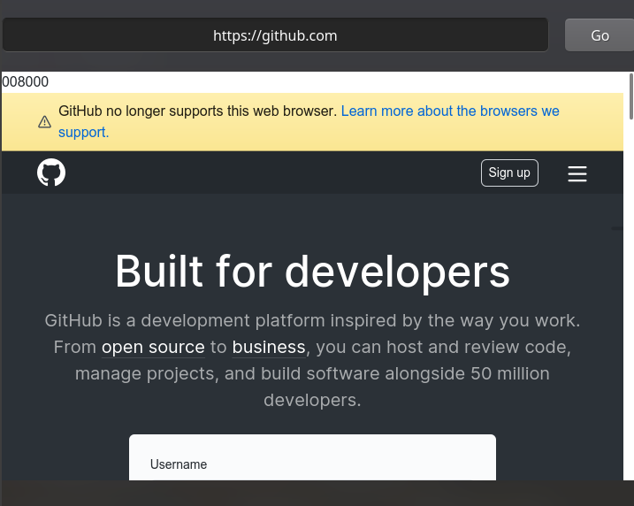
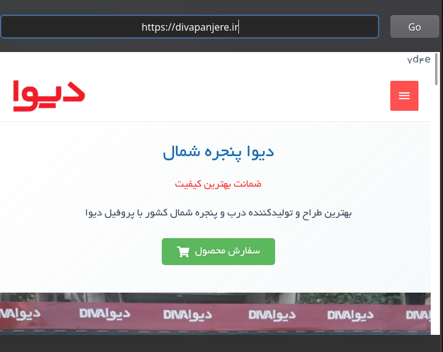
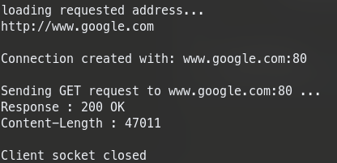

# My Internet Engineering Projects

1. Simple **Socket Programming** server-client application with Persian document

2. **Simple Browser** using only **Sockets** with Persian document
    - Limited **HTTP Server** as a server(obviously :/) supporting HTTP protocol which includes :
        * File/Doc requests handling
        * Error handling with a custom ServerError
        * Request Tokenizer
        * URL management
        * Shorted URL and URL mapping support

        Next steps would be:
        - Making the server multi-threaded
         
    - Limited **HTTP Client** for working with servers as a client which includes :
        * PyQt5 as GUI
        * HTTP and HTTPS support (for HTTPs => `https://url`)
        * URL format can be anything as long as it's a URL it works just fine
        * Response Tokenizer
        * Error handling

        Next steps would be:
        * Adding URL Query-String Support
        * Making browser multi-threaded
        * Fix Images Not being loaded although they are being downloaded through socket

## ScreenShots

    

 

    

 

    

 

    

